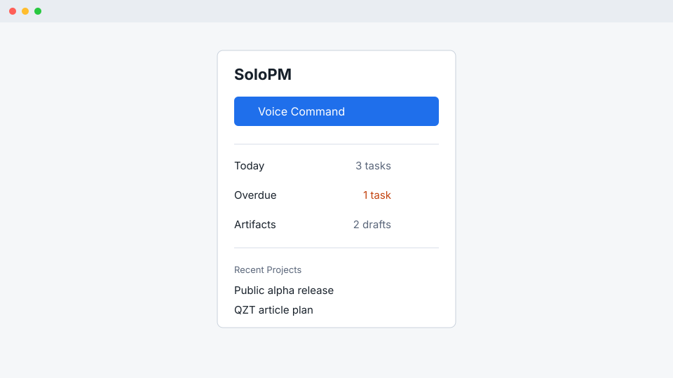

# SoloPM

[English README](README.md)

SoloPMは、声や文章で伝えた仕事をプロジェクト、タスク、予定、リマインダー、通知、ローカル文書へ整理するmacOS向けのパーソナルPMです。AIが勝手に書き込むのではなく、提案を人が確認し、**承認後に実行**することを基本にしています。

現在は、日本語を主言語として一人で仕事や個人プロジェクトを進める方を対象に、最初のパブリックアルファを準備しています。



## 最初の5分

### 1. 必要な環境

- macOS 14以降
- Xcode Command Line ToolsまたはXcode
- Git

### 2. 起動する

```sh
git clone https://github.com/albert-einshutoin/soloPM.git
cd soloPM
./script/build_and_run.sh
```

ビルド済みのアプリを検証付きで起動する場合は、次を実行します。

```sh
./script/build_and_run.sh --verify
```

初回起動後は、サイドバーのInboxで文章を入力するか、Voice Commandを開いて話しかけます。提案された計画を確認し、必要なら修正してから承認してください。プロジェクトやタスクへの書き込みは承認後に実行されます。

アプリの言語はmacOSの設定を引き継ぎます。アプリ内の「設定 > 外観 > 言語」から日本語または英語に固定することもできます。

## 画面の役割

- **Inbox**: 思いついた仕事を文章や音声で受け取る入口
- **Today**: 今日やること、期限、次の行動を確認する場所
- **Projects**: プロジェクトとタスクを整理する場所
- **Schedule**: 予定と時間軸を確認する場所
- **Done**: 完了した仕事と次のフォローアップを振り返る場所
- **Voice Command**: 音声から計画案を作る場所
- **設定**: AI、STT、TTS、権限、表示、言語を整える場所

## 最初のワークフロー

1. Inboxへ「来週金曜までにリリース準備を終えたい」のように入力します。
2. SoloPMが不足情報を確認し、プロジェクト、タスク、期限の案を作ります。
3. 内容、保存先、期限、実行される操作を確認します。
4. 修正が必要なら編集し、問題なければ承認します。
5. 承認された項目だけがローカルデータや許可済みのAppleサービスへ反映されます。

## 初期設定

### AIプロバイダー

「設定 > AI」で利用するプロバイダーを選び、APIキーを登録します。キーはmacOS Keychainに保存され、ログ、SQLite、UserDefaults、スクリーンショットへ平文で保存しない設計です。

### 音声入力と読み上げ

- **STT**: ローカル音声認識にはwhisper.cppと対応モデルを設定します。
- **TTS**: ローカル読み上げにはKokoroと対応モデルを設定します。
- モデルはアプリへ同梱されていません。設定画面でファイルやディレクトリのパスを直接入力するか、Finder形式の選択ボタンから指定できます。
- Voice Commandを使う場合は、macOSからマイク権限を許可してください。

### macOS連携

カレンダー、リマインダー、通知を使う場合は、利用する機能ごとにmacOSの権限を許可します。権限がない操作は実行せず、設定方法を案内します。

## できること

- 音声または文章からAction Planを作る
- 提案をレビューしてからプロジェクトやタスクへ反映する
- Today、Inbox、Projects、Schedule、Doneで仕事を整理する
- Apple Calendar、Reminders、Notificationsと権限の範囲で連携する
- Markdown成果物を安全な保存先へ下書きする
- 期限超過やフォローアップ候補を見つける
- ローカルの監査ログで、承認済み操作の履歴を確認する
- 日本語と英語を切り替える

## まだできないこと

- チーム、組織、権限管理、共有ワークスペース
- 複数端末間のクラウド同期
- GitHub、Gmail、Slack、Google Drive、Notionなど外部SaaSへの直接接続
- 外部MCPサーバーの実行
- 大規模な全文RAGや知識インデックス
- メール送信、Slack投稿、破壊的なファイル操作の自動実行

## 既知の制限

- STT/TTSのローカルモデルは別途用意する必要があります。
- AIプロバイダーを使う機能では、利用者自身のAPIキーとネットワーク接続が必要です。
- Developer ID署名とApple Notarizationは、証明書とnotary profileを設定したリリース用Macで行います。
- Sparkle更新には、署名済みappcastとKeychain内のEdDSAキーが必要です。
- 自動アクセシビリティ検査に加え、リリース候補ごとの手動VoiceOver確認が必要です。

「実装済み」「実行環境で確認済み」「配布準備完了」は別の状態です。最新の判定と未完了の手動作業は[リリースチェックリスト](docs/release/checklist.md)を確認してください。

## プライバシーと安全性

SoloPMはローカルファーストです。秘密情報はKeychainに保存し、外部AIへ送る文脈は必要最小限に制限します。保存や外部連携を伴う操作は、対象と内容を表示し、利用者の承認後に実行します。

詳しくは[プライバシーとセキュリティ](docs/release/privacy-security.md)と[SECURITY.md](SECURITY.md)を参照してください。

## 開発と検証

SoloPMはGitHub FlowとTDDで開発しています。ローカルの基本検証は次のとおりです。

```sh
./scripts/ci.sh
./script/build_and_run.sh --verify
swift build --product solopm-cli
.build/debug/solopm-cli --help
```

プロダクトの方向性は[ロードマップ](docs/product/roadmap.md)、アルファ版の対象範囲は[日本語パブリックアルファノート](docs/release/public-alpha-ja.md)に記載しています。
