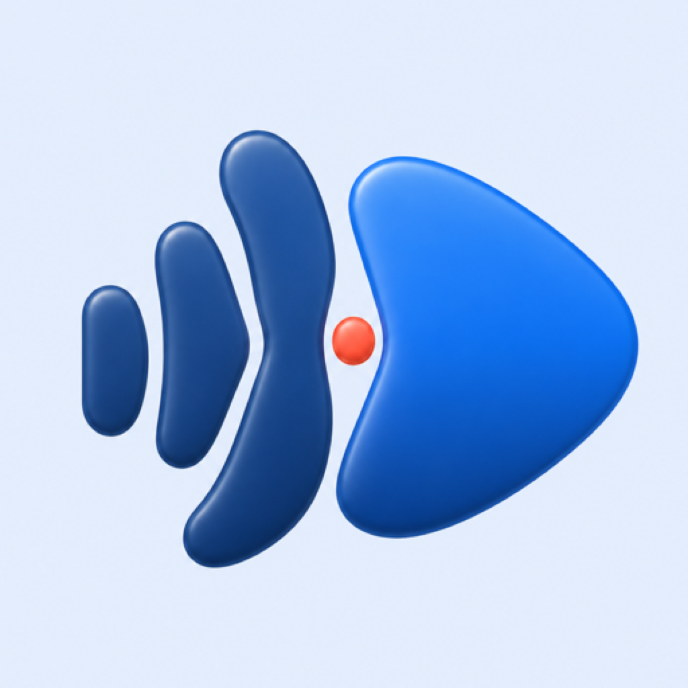
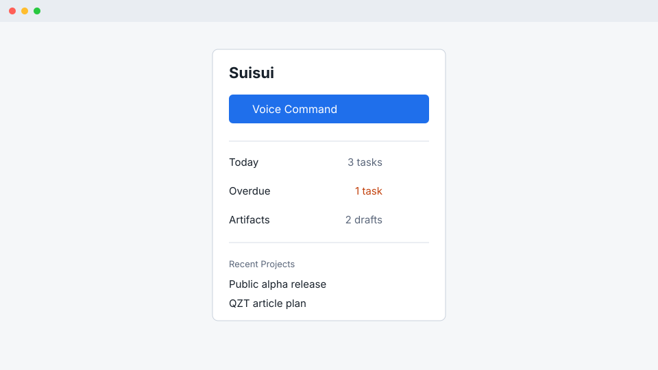

<div align="center">
  
  <h1>Suisui</h1>
  <p><strong>Speak it. Review it. Move it.</strong></p>
  <p>A local-first AI secretary and personal project manager for macOS.</p>
</div>

[日本語版 README](README.ja.md)

Suisui turns voice or text into reviewable projects, tasks, schedules, reminders, and local work artifacts. It keeps the user in control: proposed changes are shown first and only approved actions are executed.

Suisui is currently preparing its first public alpha for individual developers, creators, freelancers, and small-business operators who want to manage planning, deadlines, deliverables, and follow-up in one place.



## Public Alpha

The current release target is the **Personal MVP**: a dependable local-first loop for one person to capture, review, organize, and follow up on work. The later **Business MVP** adds organizations, roles, shared policy, knowledge integrations, and audit export without blocking the first personal release.

## MVP Scope

The public alpha focuses on the macOS app, local work management, approval-first AI assistance, Apple service adapters, reviewed file creation, and release-quality safety checks. See the [roadmap](docs/product/roadmap.md) for the boundary between Personal MVP, personal automation and sync, and Business MVP.

## Get Started in 5 Minutes

### Requirements

- Apple Silicon Mac
- macOS 14 or later
- Xcode Command Line Tools or Xcode
- Git

### Build and Launch

```sh
git clone https://github.com/albert-einshutoin/Suisui.git
cd Suisui
./script/build_and_run.sh
```

To launch the app with the product-path smoke check:

```sh
./script/build_and_run.sh --verify
```

After launch, type a request in **Inbox** or open **Voice Command** and speak. Review the proposed plan, edit it if needed, and approve only the actions you want Suisui to perform.

Suisui follows the macOS language by default. You can pin the app to English or Japanese from **Settings > Appearance > Language**.

## Product Areas

- **Inbox** — capture work from text or voice.
- **Today** — see priorities, due work, and next actions.
- **Projects** — organize projects, tasks, milestones, and documents.
- **Schedule** — review plans, workload, and calendar items on a timeline.
- **Done** — review completed work and follow-up candidates.
- **Voice Command** — turn speech into a reviewable Action Plan.
- **Settings** — configure AI, speech, integrations, MCP, permissions, appearance, and language.

## Core Workflow

1. Enter a request such as “Prepare the release by next Friday.”
2. Suisui asks for missing details and drafts a project, tasks, and due dates.
3. Review the content, destination, schedule, and operations that would run.
4. Edit the proposal or approve it.
5. Only approved actions are written to local data or permitted services.

## What Suisui Can Do

- Create Action Plans from voice or text.
- Manage work through Inbox, Today, Projects, Schedule, and Done.
- Review AI proposals before changing projects or tasks.
- Draft Apple Calendar, Reminders, and Notifications actions within granted permissions.
- Create Markdown deliverables in reviewed local destinations without silently overwriting files.
- Surface overdue work, workload, and follow-up candidates.
- Record redacted local audit history and execution receipts.
- Register local external MCP servers with explicit tool permissions, review gates, and audit history.
- Support Japanese and English UI.
- Provide a read-only `suisui-cli` for local inspection and diagnostics.

## Setup

### AI Provider

Choose a provider in **Settings > AI** and save your API key. Secrets are stored in macOS Keychain and must not be written in plaintext to logs, SQLite, UserDefaults, fixtures, screenshots, or crash reports.

### Speech

- **STT:** configure whisper.cpp and a compatible local model.
- **TTS:** configure Kokoro and a compatible local model.
- Speech models are not bundled. Select their file or directory from Settings.
- Voice Command requires microphone permission from macOS.

### Apple Services and Integrations

Calendar, Reminders, and Notifications require the corresponding macOS permissions. Suisui does not run an operation when permission is missing and instead explains what needs to be enabled.

Advanced connector and MCP foundations are present, but support depends on the configured runtime, credentials, and the explicit review boundary. Credential-backed Google Calendar production evidence is tracked separately from local implementation.

## Known Limitations

- Team accounts, organizations, roles, and shared workspaces are not implemented.
- Multi-device cloud sync is not part of the public alpha.
- General SaaS connections such as GitHub, Gmail, Slack, Google Drive, and Notion are not enabled as supported public-alpha integrations.
- Full-text RAG and large knowledge indexes are out of scope for the alpha.
- Automatic email sending, Slack posting, and destructive file operations are not supported.
- Local STT/TTS models must be installed separately.
- AI-backed features require your provider credentials and network access.
- Developer ID signing, notarization, and Sparkle publishing require release-machine credentials.
- Automated accessibility checks do not replace the manual VoiceOver pass required for each release candidate.
- Competitor hands-on research is advisory for Public Alpha readiness. Pending research is reported as `ready_with_advisories`; it does not replace or weaken distribution, security, runtime, data-integrity, or accessibility gates.

Implementation complete, runtime verified, and release ready are separate states. See the [Release Checklist](docs/release/checklist.md) for the current gates and remaining manual work.

## Platform Status

The shipped product surface is the macOS app. The Swift package also contains `SuisuiCore`, `SuisuiiOS`, and `SuisuiWeb` foundations so future clients can reuse platform-neutral task and sync contracts. These modules are foundations, not a claim that standalone iOS or web apps are publicly available.

See the [multiplatform direction](docs/product/multiplatform-automation.md), [roadmap](docs/product/roadmap.md), and [technical baseline](docs/tech_stack.md).

## Development

Suisui follows GitHub Flow and TDD. Start work from an up-to-date `main` branch and use a short-lived feature branch:

```sh
git switch main
git pull --ff-only
git switch -c feature/short-name
```

Run the shared verification entry points:

```sh
./scripts/ci.sh
./script/build_and_run.sh --verify
swift build --product suisui-cli
.build/debug/suisui-cli --help
```

`./scripts/ci.sh` is the non-GUI verification entry point used locally and in GitHub Actions. `./script/build_and_run.sh --verify` launches the normal Project Board with isolated test state and verifies the owned window, accessibility surface, and product markers. Recovery-only diagnostics are not product or release proof.

Contributor guidance is in [CONTRIBUTING.md](CONTRIBUTING.md). Product and engineering documents are indexed from [docs/README.md](docs/README.md).

## Privacy and Security

Suisui is local-first. Project data stays on the Mac unless the user chooses an AI provider or connector. Context sent outside the Mac is scoped and redacted, and write operations remain approval-gated.

See [SECURITY.md](SECURITY.md) and [Privacy & Security](docs/release/privacy-security.md). Please report public-alpha feedback through [GitHub Issues](https://github.com/albert-einshutoin/Suisui/issues) without attaching API keys, customer data, or private project content.
