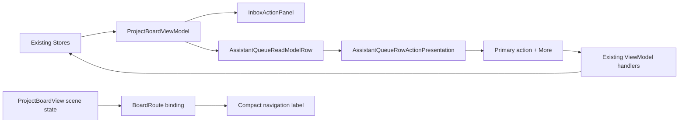

# Suisui Approval Flow Polish Design

- Date: 2026-07-28
- Status: approved for implementation
- Source baseline: `origin/main` at `823c334d4a479ff6b5efd6108fd980ddeab90e59`
- Chosen approach: Approval Flow Polish
- Decision method: UI/UX audit, three-agent architecture/TDD review, and Visual Companion selection

## 1. Objective

Inboxで対象を理解し、Reviewで現在地を保ち、Assistant Queueで次の安全な操作だけを選べる一貫した承認フローを作る。

この変更は新しいAI判断や実行能力を追加しない。既存のTask、Inbox capture、`BoardRoute`、Assistant Queue read model、approval state machine、execution coordinatorを真実源として、表示する文脈と操作の優先順位だけを改善する。

完成状態では、利用者は次の3点を画面上で即座に判断できる。

1. 何を分類または承認しようとしているか。
2. ProjectsまたはReviewのどこにいるか。
3. 現在の状態で行うべき主操作がApprove、Run、Reopenのどれか。

## 2. Chosen Approach

### 採用: 既存read model上の垂直UIスライス

次の3画面を一つの体験として改善する。

1. Inboxの分類面に、選択項目の可視文脈を追加する。
2. Projects / Reviewのcompact navigationに現在地を表示する。
3. Assistant Queueの操作を、状態別Primary actionと補助操作メニューへ整理する。

### 不採用

- Queue-only: 変更は小さいが、InboxからReviewへ移る間の文脈と現在地の問題が残る。
- Voice Task Workspaceを同時実装: 依存するconversation orchestratorとAction Linkまで横断し、単一のUI改善スライスとして大きすぎる。
- AI分類推薦を追加: 現行の`InboxTriageSummary`は入力元と解釈を示すが、推奨分類と根拠を表す契約を持たない。UIだけでMake Taskなどを強調すると、存在しない判断を利用者へ示す。
- ApproveとRunの統合: 承認記録と実行を分離する既存の安全境界を壊す。

## 3. Non-Negotiable Invariants

- Approveは承認記録だけを行い、実行しない。
- Runは既存execution gateを通り、approvedかつ実行可能な項目だけに表示する。
- Assistant QueueのStore、State Machine、Execution Coordinator、Receipt生成を変更しない。
- Inbox分類のStore操作、Undo、自動次選択、capture memo更新を変更しない。
- `BoardRoute`を現在地の唯一の真実源とし、compact専用の選択状態を追加しない。
- 既存のruntime用accessibility identifierとキーボードショートカットを維持する。
- ユーザー作成Project名とSmart List名をローカライズキーとして解釈しない。
- stateとcapabilityが不整合なQueue rowではPrimary actionを表示しない。read modelに鮮度情報はないため、stale rowの最終拒否は既存handlerとExecution Coordinatorが担保する。
- raw action arguments、secret、provider responseを新しい表示やログへ追加しない。
- macOS 14、英語、日本語、Light、Dark、keyboard、VoiceOverで既存機能へ到達できる。
- 状態変換と安全fallbackには、なぜfail-closedにするかをコメントで残す。

## 4. Information Architecture

```text
Inbox
└── Selected Item Context
    ├── Title
    ├── Detail excerpt
    ├── Source
    ├── Interpretation
    └── Classification actions

Projects / Review
└── Compact Navigation
    ├── Current destination
    ├── Assistant Queue attention count
    └── Destination menu

Assistant Queue
└── Queue Row
    ├── State, risk, summary, reason, cost, receipt
    └── Action Area
        ├── Zero or one Primary action
        └── More menu containing allowed secondary actions
```

この順序により、利用者は対象の確認、移動、承認・実行の各段階で文脈を再構築する必要がない。

## 5. Inbox Selection Context

### 5.1 Visible content

`InboxActionPanel`の分類操作より前に、選択中の項目を可視表示する。

- Title: `ProjectBoardTask.title`
- Detail excerpt: `ProjectBoardTask.detail`の空白を正規化した短い抜粋
- Manual context: `InboxTriageSummary.sourceLabel`と`interpretationLabel`
- Voice context: 既存`InboxVoiceIntakeDetail`を再利用

Titleは1〜2行、detailは最大3行とする。完全な内容はhelpまたは既存の詳細面から到達可能にし、分類カードを本文ビューにしない。

右paneの順序は`Classify`、selected title/detail、manual triage metadataまたはvoice detail、classification actionsとする。選択中voice captureがある場合、SourceとInterpretationの視覚・AX所有者は既存`InboxVoiceIntakeDetail`とし、新しいcontextへ同じmetadataを重複表示しない。既存runtimeが使う`inbox-voice-source-metadata`と`inbox-voice-interpretation`を維持する。

### 5.2 Action hierarchy

Make Task、Make Project、Schedule Today、Review Laterは同じ視覚階層を維持する。

現行read modelは推奨分類を提供しないため、特定の分類を`borderedProminent`にしない。AI推奨を将来追加する場合は、推奨先、根拠、確信度、fallbackを型付きドメイン契約として別途設計する。

### 5.3 Empty and transition states

- 未選択時: context領域へ「項目を選択してください」を表示し、分類操作を無効にする。
- 分類成功後: 既存の自動次選択に追従し、新しい選択の文脈を表示する。
- Inboxが空になった場合: 直前項目のtitle、detail、voice memoを残さない。
- Undo後: Storeが復元した選択とfeedbackを表示し、ローカルに古いpresentationを保持しない。

### 5.4 Accessibility

- Contextを見出し、title、detail、manual metadataまたはvoice detailの順に読み上げる。
- action panelの既存label、value、hintへ可視情報と同じ選択titleを反映する。
- titleやdetailの視覚的truncationにより、accessibility valueを切り詰めない。
- voice metadataを重複して同じ文として読み上げない。
- Coreが返す`sourceLabel`と`interpretationLabel`は英語のlocalization keyとして扱う。可視値とAX valueはApp側で同じlocalized valuesから再構成し、英語完成文の`summary.accessibilityValue`を日本語UIへそのまま流用しない。

## 6. Compact Navigation

### 6.1 Pure presentation policy

SwiftUIのprivate resolverをsource testだけで固定せず、Coreへ`ProjectBoardCompactNavigationPresentation`を追加する。

```swift
public struct ProjectBoardCompactNavigationPresentation: Equatable, Sendable {
    public enum Label: Equatable, Sendable {
        case localized(String)
        case verbatim(String)
    }

    public var label: Label
    public var badgeCount: Int?
}
```

Review route、Project route、Smart List route、欠損ID、badge表示を純粋関数で決定する。Appは`.localized`を`LocalizedStringKey`、`.verbatim`を`Text(verbatim:)`として描画する。

### 6.2 Review

compact menuの固定ラベル`Choose Review View`を、現在の`ReviewRoute`に対応する名称へ変える。

| Route | Visible label |
| --- | --- |
| `.primary(.review)` | Review |
| `.schedule` | Schedule |
| `.completed` | Completed |
| `.automationActivity` | Automation Activity |
| `.assistantQueue` | Assistant Queue |

Assistant Queue選択時かつ`assistantQueueCount > 0`の場合、現在地ラベルにcount badgeを併記する。countは既存`assistantQueueSnapshot.needsAttentionCount`から渡される値だけを使う。

### 6.3 Projects

| Route | Visible label |
| --- | --- |
| `.primary(.projects)` | Portfolio |
| `.project(id)` | 一致するProjectのtitle |
| `.smartList(id)` | presetはlocalized display、customは保存されたname |

通常経路では欠損Project / Smart Listを既存route validationがTodayへ修復する。Viewを単体構築した防御ケースで欠損IDが届いた場合は、存在しない名称やPortfolioを表示せず、`Project Not Found`または`Smart List Not Found`を表示する。Viewはrouteを副作用で修復しない。

### 6.4 Interaction

- menuを開閉しても`BoardRoute`を変更しない。
- destination選択時だけ既存bindingへ新しいrouteを設定する。
- current destination labelとmenu itemsの両方をkeyboardおよびVoiceOverから利用できる。
- fixed destinationには`LocalizedStringKey`、ユーザー作成名にはverbatim textを使う。
- compactとwideの境界をまたいでもselectionを再生成しない。

## 7. Assistant Queue Action Presentation

### 7.1 Pure presentation policy

新しい純粋型`AssistantQueueRowActionPresentation`を`SuisuiCore/App`へ追加する。

```swift
public struct AssistantQueueRowActionPresentation: Equatable, Sendable {
    public enum Action: Hashable, Sendable {
        case approve
        case run
        case reopen
        case edit
        case `defer`
        case reject
    }

    public var primaryAction: Action?
    public var secondaryActions: [Action]

    public static func make(
        for row: AssistantQueueReadModelRow
    ) -> AssistantQueueRowActionPresentation
}
```

Viewは`row.state`と`row.can*`を独自に再判定せず、このpresentationを描画する。

### 7.2 State matrix

| State and capability | Primary | Secondary ordering |
| --- | --- | --- |
| `.captured` / `.interpreted` / `.drafted` / `.waitingReview` / `.deferred`かつ`canApprove` | Approve | Edit, Defer, Reject |
| `.approved`かつ`canRun` | Run | Edit, Defer, Reject |
| `.failed`かつ`canRetry` | Reopen | Edit, Defer, Rejectのうち許可済み |
| `.running` | none | none |
| `.blocked` | none | 許可済みの非実行操作のみ |
| `.done` | none | none |
| `.rejected` | none | none |
| inconsistent state/capabilities | none | none |

`canApprove == true`だけで未知stateをApproveへ昇格させない。

### 7.3 Rendering

- Primary actionは0または1件。
- Primary actionには既存のlabel、system image、handler、help、AX identifier、AX hintを使う。
- Primary actionは小さい`borderedProminent`とする。
- secondary actionsが1件以上ある場合だけ`More` menuを表示する。
- More内の順序はEdit、Defer、Reject。Rejectは最後に置きdestructive roleを使う。
- Primaryに選ばれたactionをMoreへ重複させない。
- 実行不能な将来段階のボタンをdisabledで常時表示しない。
- Edit中のSave / Cancelは既存フォーム内に残し、Moreへ移さない。
- MoreからEditを選んだ場合、最初の編集fieldへfocusを移す。Save / Cancel後は同じrowのMoreへ戻し、Moreが消えた場合はPrimaryまたはrow headingへ戻す。

### 7.4 Safety rationale

stateとcapability flagの両方を確認する。capabilityだけを見ると、移行中のsnapshotや将来のstate追加によってRunが誤ってPrimaryへ昇格する可能性がある。未知または不整合な組み合わせはPrimaryなしとしてfail-closedにする。

presentation入力にはrevisionや取得時刻がないため、見た目だけでstale rowを判定しない。古いrowからRunが押された場合も、既存handlerとExecution Coordinatorが最新Store状態、承認、fingerprintを再確認して拒否する。

現行Rejectは実行中処理のcancelを保証しない。runningではRejectを含む全secondary actionを隠し、cancel semanticsは別設計とする。

## 8. Data Flow and Ownership



- App-wide dataは既存Storeが所有する。
- scene/window selectionは既存`BoardRoute`が所有する。
- Inboxのcontextは選択中Taskと既存triage summaryから毎回導出する。
- Queueのaction hierarchyは純粋presentation policyから毎回導出する。
- View-local stateは既存のInbox quick title、voice memo draft / capture ID、Queue edit formを維持し、Edit fieldのfocusだけを追加する。
- 新しい`@StateObject`、Store、cache、永続化を追加しない。

## 9. Error and Recovery Behavior

- Inbox task欠落: placeholderを表示し、全分類操作を無効にする。
- Inbox detail欠落: titleとsourceだけを表示し、空のdetail行を作らない。
- Triage summary: 選択Taskが存在する場合は、非optionalな既存`inboxTriageSummary(for:)`をそのまま使い、View側で別のsourceやinterpretationを推測しない。
- Project / Smart List欠落: 通常経路は既存validationでTodayへ修復する。防御的にHubへ届いた場合はNot Foundを表示し、存在する別destinationを装わない。
- Queue state/capability不整合: Primary actionを表示しない。
- Queue running: Rejectを含むMoreを表示せず、キャンセルを装わない。
- Queue handler失敗: 既存feedback、blocking reason、receipt表示を維持し、UIだけで成功状態へ進めない。
- localization key欠落: 英日key parity testで失敗させる。

## 10. Localization

英語・日本語へ同時に追加する。

追加する固定文言:

- Selected Item
- Select an Inbox item to classify.
- More Assistant Queue actions
- Smart List Not Found
- Transcript failed
- Transcript pending
- AI interpreted

既存のSource、Interpretation、Manual、Voice、Unprocessed、Transcript ready、Project Not Found、Make Task、Make Project、Schedule Today、Review Later、Approve、Run、Reopen、Edit、Defer、Reject、More、各destination名は再利用する。

ユーザー入力であるtask title、project title、custom smart list name、detail、source previewは翻訳しない。

## 11. TDD Plan

### 11.1 Assistant Queue policy

先に次の失敗テストを追加する。

- waiting reviewではApproveだけをPrimaryにする。
- approvedかつrunnableではRunだけをPrimaryにする。
- failedかつretry可能ではReopenだけをPrimaryにする。
- running、blocked、done、rejectedは実行系Primaryを作らない。
- state/capability不整合はfail-closedになる。
- runningではRejectを含むsecondary actionを出さない。
- Primaryはsecondaryへ重複しない。
- Rejectはsecondaryの最後になる。
- `AssistantQueueState.allCases`を決定的に処理する。

### 11.2 Assistant Queue SwiftUI contract

- `testAssistantQueueRowUsesStageSpecificPrimaryActionAndSecondaryMenu`: rowがpresentation policyを使い、Primary / Moreを段階表示する。
- Primary actionを最大1件描画する。
- secondaryがある場合だけMore menuを描画する。
- 既存action AX identifierを維持する。
- disabledな未来段階の全ボタンを並べない。

### 11.3 Inbox

- `testInboxActionPanelShowsSelectedContextWithoutDuplicatingVoiceMetadata`: 選択titleとdetail excerptが分類操作より前にある。
- manual itemはsourceとinterpretationを既存triage summaryから表示する。
- voice itemは`InboxVoiceIntakeDetail`だけがmetadataを所有し、新contextへ重複表示しない。
- 未選択placeholderとdisabled action contractがある。
- 可視contextとAX label/valueが同じ選択を示す。
- voice memo stateが選択変更後に前項目へ残らない。

### 11.4 Compact navigation

- `ProjectBoardCompactNavigationPresentationTests`でReview / Projectsの全分岐をbehavioralに検証する。
- `testCompactHubLabelsUseTypedPresentationAndPreserveDestinationParity`: SwiftUIが純粋presentationを使用する。
- Reviewの全routeが現在地ラベルへ写像される。
- `.primary(.review)`はReviewを表示する。
- Assistant Queue countはAssistant Queue選択時だけ表示される。
- Project、preset Smart List、custom Smart Listを正しい表示方式で扱う。
- 欠落IDはNot Foundを表示し、Portfolioを装わない。
- compact menuのdestination parityを維持する。

### 11.5 Localization and accessibility

- 英日key parity。
- icon-only / menu controlsにlabel、help、AX identifierを付与。
- keyboardからcompact menu、Primary action、More actionsへ到達可能。
- MoreからEditへ移動し、Save / Cancel後に元のrowへfocusを戻せる。
- statusやpermissionを色だけで表さない。
- `testApprovalFlowRequiresInboxContextCompactNavigationAndQueueActions`: Inbox context、compact navigation、Queue Primary / Moreを`AccessibilityFocusPathRequirement`へ追加する。
- pseudo VoiceOver検査でも同じrequired nodeを要求する。

### 11.6 Visual evidence

- `testCaptureUsesLocaleSpecificManifestOverrideWithoutMixingArtifacts`: capture scriptがlocale別manifestとartifact rootを尊重する。
- `testJapaneseVisualManifestUsesJaContextAndSeparateRoots`: ja-JP manifestが専用のartifact / baseline rootと`ja-JP` contextを持つ。
- `testApprovalFlowScreensExistInBothLocaleManifests`: Inbox、compact navigation、Queue主要状態が英日双方に存在する。
- localeがmanifest contextと一致しないcapture / AX receiptは成功扱いにしない。

## 12. Verification

Focused:

```bash
test "$(swift test list | rg -c 'AssistantQueueRowActionPresentationTests')" -gt 0
test "$(swift test list | rg -c 'ProjectBoardCompactNavigationPresentationTests')" -gt 0
test "$(swift test list | rg -c 'testAssistantQueueRowUsesStageSpecificPrimaryActionAndSecondaryMenu')" -eq 1
test "$(swift test list | rg -c 'testInboxActionPanelShowsSelectedContextWithoutDuplicatingVoiceMetadata')" -eq 1
test "$(swift test list | rg -c 'testCompactHubLabelsUseTypedPresentationAndPreserveDestinationParity')" -eq 1
test "$(swift test list | rg -c 'testApprovalFlowRequiresInboxContextCompactNavigationAndQueueActions')" -eq 1
test "$(swift test list | rg -c 'testCaptureUsesLocaleSpecificManifestOverrideWithoutMixingArtifacts')" -eq 1
test "$(swift test list | rg -c 'testJapaneseVisualManifestUsesJaContextAndSeparateRoots')" -eq 1
test "$(swift test list | rg -c 'testApprovalFlowScreensExistInBothLocaleManifests')" -eq 1
swift test --filter AssistantQueueRowActionPresentationTests
swift test --filter ProjectBoardCompactNavigationPresentationTests
swift test --filter testAssistantQueueRowUsesStageSpecificPrimaryActionAndSecondaryMenu
swift test --filter testInboxActionPanelShowsSelectedContextWithoutDuplicatingVoiceMetadata
swift test --filter testCompactHubLabelsUseTypedPresentationAndPreserveDestinationParity
swift test --filter testApprovalFlowRequiresInboxContextCompactNavigationAndQueueActions
swift test --filter testCaptureUsesLocaleSpecificManifestOverrideWithoutMixingArtifacts
swift test --filter testJapaneseVisualManifestUsesJaContextAndSeparateRoots
swift test --filter testApprovalFlowScreensExistInBothLocaleManifests
```

Integration:

```bash
swift test --filter AssistantQueueStoreTests
swift test --filter ProjectBoardStoreTests
swift build --product Suisui
./script/check_accessibility_preflight.sh --source-only
./script/check_pseudo_voiceover_paths.sh
./script/check_runtime_inbox_triage_smoke.sh
./script/check_runtime_development_pr_smoke.sh
```

Visual:

```bash
./script/check_visual_regression_smoke.sh \
  --manifest docs/quality/visual-baseline-manifest.json \
  --screenshot-dir docs/release/evidence/ui-screenshots \
  --baseline-dir docs/quality/visual-baselines \
  --ax-audit-result .tmp/visual-ax-audit-receipt.json

./script/check_visual_regression_smoke.sh \
  --manifest docs/quality/visual-baseline-manifest-ja.json \
  --screenshot-dir docs/release/evidence/ui-screenshots-ja \
  --baseline-dir docs/quality/visual-baselines-ja \
  --ax-audit-result .tmp/visual-ax-audit-receipt-ja.json
```

Full validation:

```bash
./script/run_complete_swiftpm_tests.sh
swift build --product Suisui
./script/check_security_regressions.sh
git diff --check
```

`swift test --filter`単独では0件成功を許すため、事前に`swift test list`でexact test suiteが1件以上存在することを確認する。対象範囲を安全に限定できない、selectorが0件、source contractとruntimeが食い違う、またはrename判定が曖昧な場合はfocused結果を成功扱いにせず完全検証を実行する。

Manual:

- 1099pt / 1100ptのHub境界前後と、window sidebarを含めwide Hubが成立する十分な幅。
- Light / Dark。
- en-US / ja-JP。
- Inbox未選択、manual、voice capture、分類後の次選択、Undo。
- Queue waiting review、approved、failed、running、done、inconsistent fixture。
- keyboard-only。
- VoiceOverのcontext → Primary → More順。

Tracked visual evidence:

- Inbox selected manual itemとselected voice item。
- Review / Projects compact current label。
- Queue waiting review、approved、failed。
- Light / Dark、en-US / ja-JP。

現行manifest schemaはlocaleを全体で1つだけ持つため、英日を同じmanifestへ混在させない。

- en-US: 既存`visual-baseline-manifest.json`、`ui-screenshots`、`visual-baselines`。
- ja-JP: 新規`visual-baseline-manifest-ja.json`、`ui-screenshots-ja`、`visual-baselines-ja`。

`capture_ui_evidence.sh`へ`SUISUI_VISUAL_BASELINE_MANIFEST` overrideを追加し、`SUISUI_UI_EVIDENCE_LOCALE`、`SUISUI_UI_EVIDENCE_DIR`、`SUISUI_VISUAL_AX_AUDIT_RESULT`と一緒にlocaleごとのcaptureを実行する。両manifestを独立したvisual gateで検証し、screen + theme keyをlocale間で共有しない。

環境上取得できない状態は成功扱いにせず、欠けた組み合わせと理由をevidenceへ記録する。

## 13. Files

### Add

- `Sources/SuisuiCore/App/AssistantQueueRowActionPresentation.swift`
- `Sources/SuisuiCore/App/ProjectBoardCompactNavigationPresentation.swift`
- `Tests/SuisuiCoreTests/AssistantQueueRowActionPresentationTests.swift`
- `Tests/SuisuiCoreTests/ProjectBoardCompactNavigationPresentationTests.swift`

### Modify

- `Sources/SuisuiApp/Views/ProjectWorkflowAssistantQueueView.swift`
- `Sources/SuisuiApp/Views/ProjectWorkflowInboxView.swift`
- `Sources/SuisuiApp/Views/ProjectBoardReviewHubView.swift`
- `Sources/SuisuiApp/Views/ProjectBoardProjectsHubView.swift`
- `Sources/SuisuiApp/Resources/en.lproj/Localizable.strings`
- `Sources/SuisuiApp/Resources/ja.lproj/Localizable.strings`
- `Tests/SuisuiCoreTests/AppExperienceSourceTests.swift`
- `Tests/SuisuiCoreTests/AssistantQueueStoreTests.swift`
- `Tests/SuisuiCoreTests/AccessibilityFocusPathAuditTests.swift`
- `Tests/SuisuiCoreTests/UIGateScriptsTests.swift`
- `Tests/SuisuiCoreTests/VisualEvidenceRuntimeContextTests.swift`
- `Tests/SuisuiCoreTests/ReleasePipelineTests.swift`
- `Sources/SuisuiCore/App/AccessibilityFocusPathAudit.swift`
- `script/check_pseudo_voiceover_paths.sh`
- `script/capture_ui_evidence.sh`
- `docs/quality/visual-baseline-manifest.json`
- `docs/quality/visual-baseline-manifest-ja.json`
- `docs/release/evidence/ui-screenshots-ja/`の対象PNGとmetadata
- `docs/quality/visual-baselines-ja/`の対象PNGとmetadata
- 既存en-US対象画面のvisual baseline PNGとmetadata

## 14. Non-Goals

- Voice Task Conversation Workspace。
- conversation orchestrator、Action Link、Receipt schemaの変更。
- Today、Schedule、Done、Settings、Voice Commandの再設計。
- AI分類推薦、確信度、推薦理由。
- Queue batch approve / batch run。
- auto approval、auto execution。
- Queue Store、State Machine、Execution Coordinatorの再設計。
- 新しいSQLite schema、migration、external connector。
- 汎用AI秘書機能。

## 15. Completion Criteria

- Inbox分類前に、操作対象と入力元を視覚・VoiceOverの両方で確認できる。
- compact Projects / Reviewで現在地を読み取れる。
- Assistant Queueの各rowにPrimary actionが最大1件だけ表示される。
- Approve、Run、Reopenの段階が同時表示されない。
- 各stateで許可されたEdit、Defer、RejectへMoreから到達でき、runningではMoreを表示しない。
- 既存approval / execution / receipt contractが変わっていない。
- 英語・日本語、keyboard、VoiceOverの到達性が維持される。
- Inbox、compact navigation、Queueの主要状態が英日・Light/Darkの追跡対象になっている。
- focused、integration、complete、security検証が成功する。
- runtimeで確認できない項目を自動検査成功だけで完了扱いにしない。
