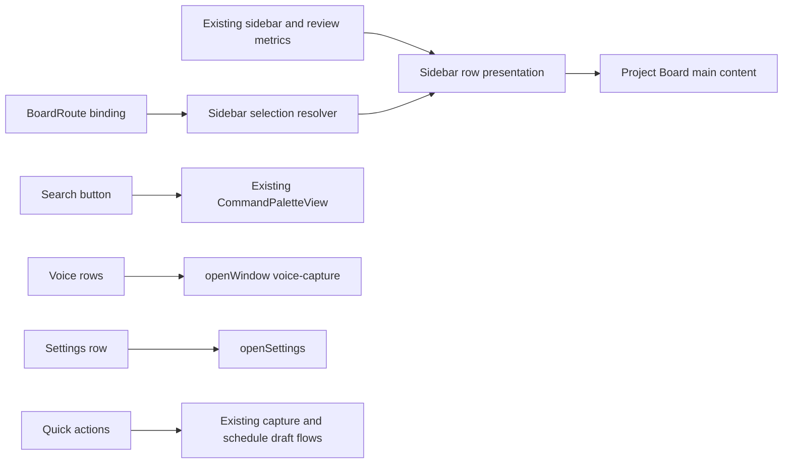

# Today Sidebar Parity Design

- Date: 2026-08-02
- Status: approved for implementation
- Source baseline: `origin/main` at `9209f5551e25fc8630dee9972c69c14af0c9282a`
- Reference: `ui-samples/today.png`
- Chosen approach: sample-faithful sidebar with existing Suisui behavior
- Decision method: repository inspection, Visual Companion comparison, and icon semantic self-review

## 1. Objective

`today.png`のサイドバー密度、ブランド、選択表現、7項目構成、下部クイックアクションをSuisuiのProject Boardへ反映する。

見た目だけの複製にはしない。既存の`BoardRoute`、command palette、Voice Command window、Settings scene、Inbox capture、Schedule draftを真実源として、各行を現在の製品機能へ接続する。

完成状態では、利用者は次のことをサイドバーだけで判断・実行できる。

1. 現在表示している主要画面。
2. Inbox、Today、Projects、Schedule、Completedへの移動。
3. Voice CommandとSettingsの起動。
4. タスク追加、音声追加、時間ブロック作成への短い導線。

## 2. Chosen Approach

### 採用: A案 — sample-faithful

- 上部へアプリアイコンと`Suisui`ブランドを置く。
- その下へ検索フィールド風のcommand palette起動ボタンを置く。
- 中央へ`today.png`と同じ7項目を同じ順序で置く。
- 下部へ3つのクイックアクションを固定する。
- 選択行は青系の背景、角丸、青いアイコンとラベルで示す。
- macOSのLight / Dark Modeに追従するsemantic colorを使う。

### 不採用

- 現行の4項目を維持したまま装飾だけ変更: `today.png`との情報密度と操作導線の差が残る。
- `ProjectBoardSidebarDestination`を再び全面採用: 現在の型付き`BoardRoute`移行を逆行させ、legacy adapterの撤去を妨げる。
- Voice CommandとSettingsを`BoardRoute`へ追加: どちらもProject Boardのコンテンツではなく、独立window / sceneを開くactionである。
- `briefcase`をProjectsへ使用: 「仕事」を表し、個人プロジェクトを含むSuisuiのcontainer概念より狭い。
- `calendar.badge.checkmark`をScheduleへ使用: 予定全体ではなく、確定済み・完了済みに見える。
- `calendar.badge.plus`を時間ブロックへ使用: 外部Calendarへの即時書き込みと誤認されやすい。

## 3. Information Architecture

```text
Sidebar
├── Brand
│   ├── Suisui app icon
│   └── Suisui
├── Search / Command Palette
├── Destinations and utilities
│   ├── Inbox
│   ├── Today
│   ├── Projects
│   ├── Schedule
│   ├── Completed
│   ├── Voice Command
│   └── Settings
└── Quick Actions
    ├── Add Task
    ├── Add by Voice
    └── Block Time
```

7項目は一つの視覚グループとして配置するが、内部の意味は二種類に分ける。

- destination: `BoardRoute`を変更し、Project Boardのメインコンテンツを切り替える。
- utility action: route selectionを変更せず、独立したwindowまたはsceneを開く。

この区別により、7項目の見た目を再現しながら、SettingsやVoice Commandを不正なProject Board routeとして永続化しない。

## 4. Row Mapping

| Order | Visible label | SF Symbol | Kind | Existing behavior |
| --- | --- | --- | --- | --- |
| 1 | Inbox | `tray` | destination | `.primary(.inbox)` |
| 2 | Today | `sun.max` | destination | `.primary(.today)` |
| 3 | Projects | `folder` | destination | `.primary(.projects)` |
| 4 | Schedule | `calendar` | destination | `.review(.schedule)` |
| 5 | Completed | `checkmark.circle` | destination | `.review(.completed)` |
| 6 | Voice Command | `mic` | utility action | `openWindow(id: "voice-capture")` |
| 7 | Settings | `gearshape` | utility action | `openSettings()` |

### Selection ownership

- `route`を唯一の選択状態とする。
- `.project`と`.smartList`はProjects行を選択表示する。
- `.review(.schedule)`はSchedule行を選択表示する。
- `.review(.completed)`はCompleted行を選択表示する。
- `.primary(.review)`、`.review(.automationActivity)`、`.review(.assistantQueue)`は7項目に専用行がないため、どの行も偽って選択しない。
- Voice CommandとSettingsを押しても、現在のdestination選択を維持する。

### Counts

- Inbox、Today、Projectsは既存`ProjectBoardSidebarCounts`の値を表示する。
- ScheduleとCompletedは既存Review metricsから個別countを供給できる場合だけ表示する。
- Voice CommandとSettingsにcountは表示しない。
- `0`は表示せず、VoiceOver valueでは既存の空状態表現を維持する。
- Schedule / Completedを旧Review合計countで代用しない。意味の異なる数字を表示するくらいならcountなしを選ぶ。

## 5. Icon Semantics

### Final mapping

- Search: `magnifyingglass`
- Inbox: `tray`
- Today: `sun.max`
- Projects: `folder`
- Schedule: `calendar`
- Completed: `checkmark.circle`
- Voice Command: `mic`
- Settings: `gearshape`
- Add Task: `plus.circle`
- Add by Voice: `mic.circle`
- Block Time: `calendar.badge.clock`

これらはmacOSで利用可能で、推奨したnavigation / workflow symbolsには既存Suisui内での使用実績がある。

アイコンは行ラベルの補助であり、単独で意味を所有しない。SwiftUIでは`accessibilityHidden(true)`とし、行全体のlocalized label、value、hintを読み上げる。

## 6. Visual Specification

### Brand

- `packaging/Suisui-AppIcon-1024.png`と同じアプリアイコン資産を、Project Boardで利用可能なApp resourceとして扱う。
- アイコンは小さな角丸正方形として表示し、隣に`Suisui`を置く。
- 画像が欠損した場合に別ブランドへ置き換えない。ビルド時にresource存在を検証する。

### Search

- `today.png`の検索pillに寄せた全幅buttonとする。
- 左に`magnifyingglass`、中央にSearch label、右に既存shortcut `⌘K`を表示する。
- text fieldを偽装せず、押すと既存`CommandPaletteView`を開くbuttonとして実装する。

### Navigation rows

- 行のicon、label、countを水平配置する。
- 行全体をclick targetとし、狭いiconだけを押させない。
- 選択は角丸背景、foreground、macOSのfocus ring / keyboard stateで示す。
- 色だけに依存せず、背景形状とselection semanticsを併用する。
- utility actionはdestinationと同じ行形状だが、selection stateを持たない。

### Quick Actions

- navigationとの間に余白とseparatorを設け、サイドバー下端へ寄せる。
- `Add Task`: Inboxの既存capture composerへfocusまたは既存add-task flowを起動する。
- `Add by Voice`: `openWindow(id: "voice-capture")`でVoice Commandを開く。
- `Block Time`: 既存Schedule Block / Schedule Draft導線を使い、外部Calendarへ直接書き込まない。
- actionを実行しただけではProject Board routeを意図せず変更しない。必要な既存workflowがroute遷移を所有する場合だけ、その既存契約へ従う。

### Sizing and scrolling

- 7項目とquick actionsが収まる通常window高では下部actionsを視認できる。
- 高さが不足する場合、brand / searchを含む全体を潰さず、navigation領域をscroll可能にする。
- labelを省略しすぎないsidebar minimum widthを設定し、windowの既存resize contractを壊さない。

## 7. Architecture and Data Flow



### Ownership

- `ProjectBoardSidebarView`は表示とrow interactionを所有する。
- `ProjectBoardView`は`openWindow`、`openSettings`、command palette visibility、quick action handlersを注入する。
- Coreはroute conversionやselection policyなど、SwiftUIを必要としない純粋な判断だけを所有する。
- Viewへ独立したselected-row stateを追加しない。
- legacy `ProjectBoardSidebarDestination`を新しい真実源に戻さない。

### Testable presentation policy

5つのdestination rowに対する選択解決は純粋関数または純粋computed policyとしてテストする。

| Route | Selected row |
| --- | --- |
| `.primary(.inbox)` | Inbox |
| `.primary(.today)` | Today |
| `.primary(.projects)`, `.project`, `.smartList` | Projects |
| `.review(.schedule)` | Schedule |
| `.review(.completed)` | Completed |
| `.primary(.review)`, other review routes | none |

未知または将来追加されるrouteを既存行へ推測で割り当てない。誤った現在地表示を防ぐため、unknown mappingはselectionなしとしてfail-closedにする理由をコードコメントで残す。

## 8. Interaction and Accessibility

- destination rowはkeyboard navigationとVoiceOver selection semanticsを持つ。
- utility actionとquick actionはButton semanticsを持つ。
- visible Japanese labelとAX labelは同じlocalization sourceから生成する。
- countはlabelと分離して羅列せず、行のAX valueとして自然な件数文にする。
- `⌘1`〜`⌘4`の既存keyboard destination contractを壊さない。サイドバーの表示順変更とshortcut順を無理に一致させず、既存shortcutの意味を維持するか、別途明示的に契約を更新してテストする。
- `⌘K`はSearch buttonとcommand paletteの両方で同じ機能を開く。
- Reduce Motion、Increase Contrast、Light、Dark、System appearanceを確認する。
- app iconにはブランド名と重複する不要なVoiceOver読み上げを付けない。

## 9. Error and Edge States

- `openWindow`または`openSettings`後もProject Boardのrouteは保持する。
- windowが既に開いている場合は既存macOS scene behaviorで前面化し、重複したアプリ内stateを作らない。
- quick actionの対象workflowが利用不能な場合、無反応にせず既存のdisabled reasonまたはエラー提示契約を使う。
- Schedule / Completed countが取得できなければ非表示とし、Review合計を捏造しない。
- app icon resource欠損は実行時の透明画像fallbackにせず、resource / snapshot testで検出する。
- 狭い高さでもSettingsとquick actionsへのkeyboard / VoiceOver到達性を維持する。

## 10. TDD and Verification

実装は次の順序で行う。

1. routeからselected rowを決める失敗テストを追加する。
2. 7項目の順序、label、symbol、destination / action種別を固定するpresentation testを追加する。
3. quick action mappingと「Block Timeが直接外部書き込みを行わない」handler境界をテストする。
4. 最小のCore / App wiringを実装する。
5. Japanese / English localizationとaccessibility identifierを追加する。
6. Light / Dark / Systemのvisual baselineを更新する。
7. focused tests、Swift build、全テスト、visual gate、security checkを実行する。

### Required evidence

- Core unit tests: route selection、ordering、icon/action mapping、unknown fallback。
- App source tests: actual app icon resource、7 visible labels、quick action handlers、AX identifiers。
- Runtime AX: keyboard traversal、VoiceOver label/value/hint、selected state、small-height reachability。
- Visual: `today.png`とのsidebar比較、Light / Dark / System baseline。
- Behavior: Search、5 destinations、Voice Command、Settings、3 quick actionsが既存機能へ接続される。
- Safety: Block Timeはdraft / approval-first境界を越えず、外部Calendarへ即時書き込みしない。

## 11. Scope Boundary

### In scope

- Project Board sidebarのブランド、検索、7項目、selected styling、quick actions。
- 既存機能へのhandler wiring。
- 必要なCore presentation policy、localization、tests、visual baselines、AX evidence。

### Out of scope

- Todayメインコンテンツの`today.png` parity。
- 新しいtask store、schedule engine、Calendar write capability。
- Voice Command、Settings、Schedule workflow自体の再設計。
- Review hub内部のAutomation Activity / Assistant Queue再配置。
- legacy route migration全体の撤去。

Todayメインコンテンツは、サイドバー完成後に別の設計・実装スライスとして扱う。
