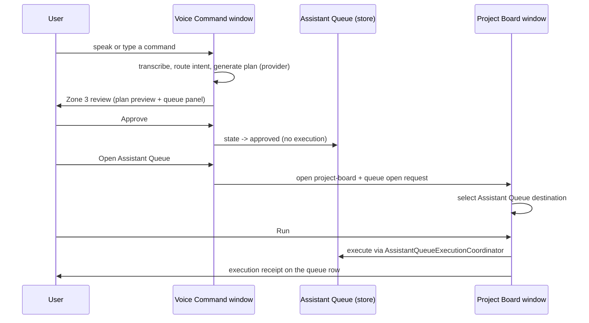
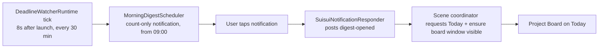
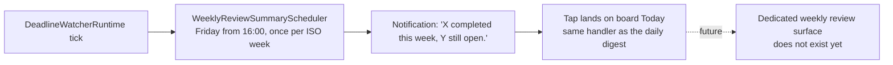
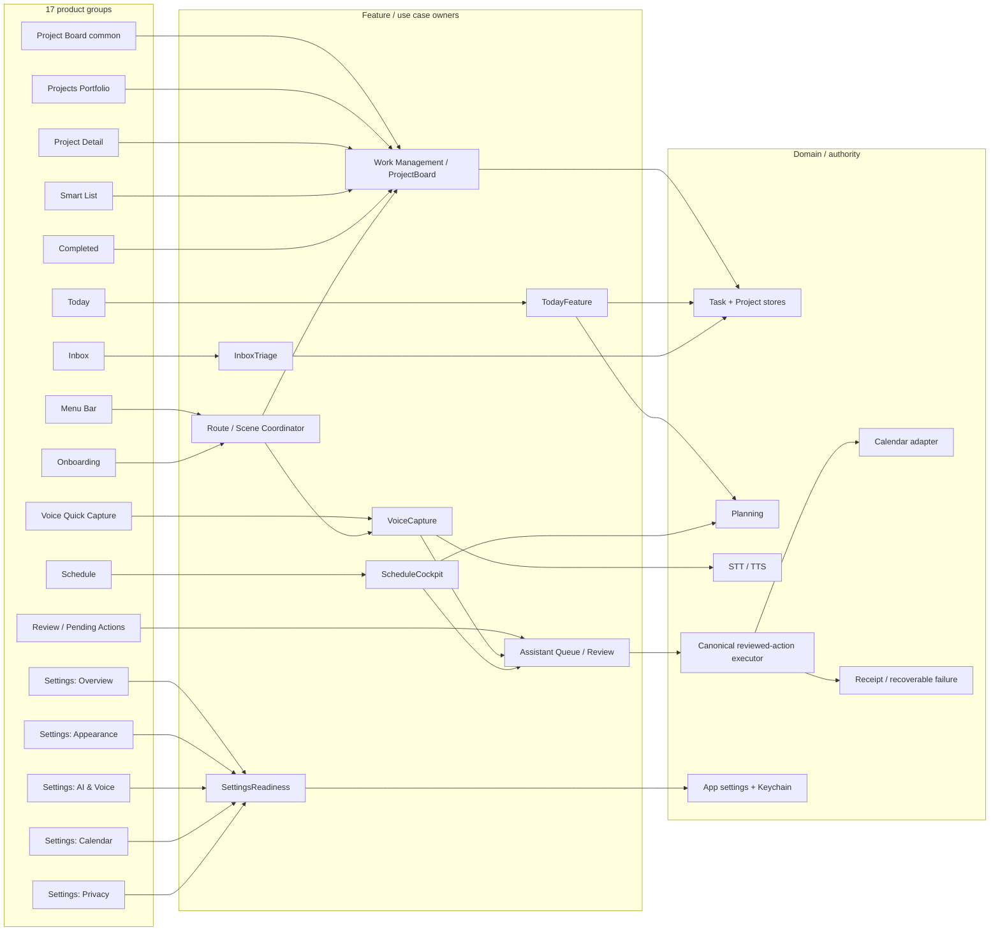

# Information Architecture

How Suisui's four surfaces divide responsibility, the modal rules they
follow, and the primary flows between them. Every claim below is grounded in
the current code (files cited inline); the final section lists honest gaps.

## Window responsibilities

### Project Board window (`project-board`)

The main window (`Sources/SuisuiApp/Views/ProjectBoardView.swift`,
`ProjectWorkflow*.swift`).

The source list owns exactly four stable product areas
(`ProjectBoardSidebarView.swift`): **Today → Inbox → Projects → Review**.
Feature-level navigation lives one level in, inside two hubs, so adding a
workflow cannot grow the top level again:

- **Projects hub** (`ProjectBoardProjectsHubView.swift`): Portfolio, Smart
  Lists, Active / Completed / Archived projects.
- **Review hub** (`ProjectBoardReviewHubView.swift`): Plan → Schedule; Work →
  Completed; Automation → Automation Activity, Assistant Queue.

Both hubs render a second list beside the detail above
`ProjectBoardHubPresentationPolicy.wideMinimumWidth` (1100 pt) and collapse to
a "Choose …" menu below it.

The default destination is **Today**
(`ProjectBoardSelectionPersistence.swift`: persisted
`defaultRawValue = "today"`; unresolved selections fall back to `.today`).

`⌘1`–`⌘4` select the four primary destinations in rendered order
(`BoardPrimaryDestination.orderedForKeyboardSelection`, wired in
`ProjectBoardView.swift`). Inbox classification uses `⌃⌘1`–`⌃⌘4`.

Owns:
- All task/project reading and mutation surfaces: workflow views per
  destination, kanban columns per project (`ProjectBoardDetail`), task and
  project editing via the inspector, board operation undo (⌘Z,
  `BoardOperationUndo.swift`).
- The command palette (⌘K, `CommandPaletteView.swift`), including quick
  Inbox task creation and content search.
- Assistant Queue review **and execution**: the Run button in
  `ProjectWorkflowAssistantQueueView.swift` calls
  `ProjectBoardViewModel.runAssistantQueueItem(id:)`, which drives
  `AssistantQueueExecutionCoordinator` and produces execution receipts.

Does not do: voice capture, plan drafting, or settings — commands arrive
here already interpreted (from the Voice window, palette, or notifications).

### Voice Command window (`voice-capture`)

`Sources/SuisuiApp/Views/VoiceCaptureView.swift`, three stacked zones.

Owns:
- Capture (Zone 1): record/stop, typed transcript editing, Save to Inbox,
  Ask (workspace Q&A), Generate Plan, low-latency agent mode.
- Interpretation (Zone 2): streaming plan preview, routed intent preview,
  clarification Q&A, workspace answer display and TTS replay.
- Review handoff (Zone 3): plan preview, Assistant Queue panel with
  Approve / Defer / Reject and "Open Assistant Queue".

Does not do: execution. `VoiceCaptureViewModel.approveAssistantQueueItem`
only advances queue state and persists it; running an approved item happens
in the Project Board's Assistant Queue view. The capture placeholder states
the boundary: "Inbox captures stay local. Plans wait in Review › Assistant
Queue before execution."

### Settings window

`Sources/SuisuiApp/Views/SettingsView.swift`. Six tabs
(`enum SettingsTab`): **Overview, Appearance, AI, MCP, Sync, Privacy**.

Owns:
- Two-tier disclosure: MCP and Sync are advanced tabs, hidden until the
  `suisui.settings.showAdvanced` toggle (`@AppStorage`, default off) is
  enabled; leaving advanced mode while on MCP/Sync falls back to Overview.
- Provider configuration and readiness (API keys in Keychain), voice model
  management, notification/quiet-hours preferences, backup/restore,
  diagnostics export, developer mode, launch-at-login, data location.
- Wide Settings desks (`CockpitLayoutPolicy.presentsSplitRail`) keep a
  readiness rail on Overview (`settings-overview-detail-rail`) and AI
  (`settings-ai-readiness-rail`). Below the split floor the same rail
  stacks under the form so readiness stays reachable. Appearance stays
  control-layer only (Liquid Glass theme/language pickers) and never shows
  a fake “Save Changes” hero — preference writes apply immediately.

Sample vocabulary mapping (marketing mock → product TabView):

| Sample label | Product tab / surface |
| --- | --- |
| 一般 / General | Overview |
| AIとモデル / AI & Models | AI |
| 音声 / Voice | AI (STT/TTS + voice models) |
| 連携 / Integrations | Sync + MCP (advanced) and Overview readiness tiles |
| セキュリティ / Security | Privacy |
| データ / Data | Privacy (data location / backup) |

Does not do: task or plan content display — Overview shows status labels
only, and diagnostics/backup surfaces deal in counts and files, not rows.
Does not do: fake Pro badges or a Settings-wide Save Changes CTA.

### Menu bar panel

`MenuBarExtra` in `Sources/SuisuiApp/SuisuiApp.swift`; panel content in
`Sources/SuisuiApp/Views/MenuBarPanel.swift`.

Owns:
- Glanceable summary: label badge with overdue count when > 0; panel card
  with Today / Overdue / This Week counts and up to three recent projects
  (`Sources/SuisuiCore/App/MenuBarSummary.swift`).
- Quick capture to Inbox: one text field + Add (⌘↩) via
  `MenuBarQuickCaptureController` (creates a backlog task in the Inbox
  project, with natural-language due-date parsing).
- Window shortcuts: the summary card is one big "Open Today" button
  (forces the board onto Today), plus Project Board and Voice Command
  (⌥Space) buttons and a Settings link.

Does not do: task editing, plan review, or execution — every affordance
either captures one Inbox task or routes to a full window.

## Modal usage rules (as they exist)

- **Sheets** are used for self-contained create/edit flows that block their
  window: the smart list editor
  (`.sheet(isPresented: $isPresentingSmartListEditor)` →
  `SmartListEditorSheet`, `ProjectBoardView.swift` /
  `ProjectBoardSmartListViews.swift`), first-run onboarding
  (`.sheet(isPresented: $isOnboardingPresented)` → `OnboardingWelcomeView`,
  `SuisuiApp.swift`), and the development automation review panel
  (`.sheet(item: $developmentAutomationReviewSheet)` → `ActionReviewPanel`,
  `ProjectBoardView.swift`).
- **Inspector** is the task/project editing surface, not a sheet:
  `.inspector(isPresented:)` in `ProjectBoardView.swift` hosts
  `TaskInspectorView` or `ProjectInspectorView`; project destinations
  auto-open it.
- **Confirmation dialogs** guard destructive or externally visible actions
  only: "Delete MCP Server" and "Disconnect Google Calendar" (both
  `role: .destructive`, `SettingsView.swift`), "Sync due tasks to Google
  Calendar?" (external write, `ProjectBoardView.swift`), and "Restore from
  backup?" (`SettingsView.swift` — additive confirm, message states
  "Existing data is never changed or deleted"). Task/project delete and
  archive use an inline two-step destructive confirmation inside the
  inspector (`InspectorDestructiveConfirmation`, `ProjectBoardView.swift`)
  rather than a dialog.

## Primary flows

### Thought → voice → review → board

Verified in `VoiceCaptureView.swift` (`postAssistantQueueOpenRequest`),
`ProjectBoardView.swift` (`handleAssistantQueueOpenRequest`), and
`ProjectWorkflowAssistantQueueView.swift` (Run →
`runAssistantQueueItem(id:)`).

### Morning digest → Today → work

Verified in `Sources/SuisuiCore/Deadline/MorningDigest.swift` (one
count-only digest per day, hour ≥ 9),
`Sources/SuisuiApp/Composition/DeadlineWatcherRuntime.swift` and
`NotificationInteractionRuntime.swift`, and the app delegate observer in
`SuisuiApp.swift` (`ProjectBoardSceneCoordinator.shared.requestOpen(route: .primary(.today))`).

### Weekly review (notification-only today)

Verified in `Sources/SuisuiCore/Deadline/WeeklyReviewSummary.swift`
(schedule-only, count-only body) and
`NotificationInteractionRuntime.swift`, where `suisui-weekly-review-`
notification taps share the daily digest branch and therefore open Today.
**Future marker:** there is no weekly-review window or destination; the
notification is currently the entire feature.

## MVP0 surface inventory

The target is 17 product groups, not 17 windows. A group may be a nested
workflow or a settings tab. Recovery-only views, the app shell, and Web Surface
definitions are implementation surfaces and are not counted as product screens.
Each function carries its own current MVP0 decision and exact code owner:
`reuse` keeps the owner and route, `move` puts an existing capability under a
canonical group, `change` keeps the capability but changes its contract, `add`
is a missing capability, and `remove` deletes a duplicate route after its
replacement is reachable. For `move`, the arrow between two files records the
current owner and intended destination; an owner that does not exist yet stays
in the phase handoff table instead of being presented as current code evidence.

| Product group | Function decisions and exact owners | Domain authority |
| --- | --- | --- |
| Project Board common | Search `[reuse → CommandPalette.swift + CommandPaletteView.swift]`; task add `[reuse → ProjectBoard.swift + ProjectBoardView.swift]`; Voice Capture entry `[reuse → ProjectBoardView.swift]`; Inspector `[reuse → ProjectBoardInspectors.swift + ProjectBoardView.swift]`; Undo `[reuse → BoardOperationUndo.swift + ProjectBoard.swift]`; Review notification `[change → AssistantQueue.swift + ProjectBoard.swift]` | `ProjectBoard` / Work Management stores |
| Today | Today/overdue `[reuse → TodayFeatureViewModel.swift + ProjectWorkflowTodayView.swift]`; Current Focus `[reuse → TodayDashboardView.swift + TodayFeatureViewModel.swift]`; Next Tasks `[reuse → TodayDashboardView.swift + TodayFeatureViewModel.swift]`; scheduled tasks `[reuse → TodayDashboardView.swift + TodayFeatureViewModel.swift]`; Needs Attention `[reuse → TodayDashboardView.swift + TodayFeatureViewModel.swift]`; quick add `[reuse → ProjectWorkflowTodayView.swift + ProjectBoard.swift]`; Catch Up `[reuse → ProjectWorkflowTodayView.swift + ProjectBoard.swift]` | Today snapshots + Work Management |
| Inbox | Capture list `[reuse → ProjectWorkflowInboxView.swift + ProjectBoard.swift]`; quick add `[reuse → ProjectWorkflowInboxView.swift + ProjectBoard.swift]`; select/note `[reuse → ProjectWorkflowInboxView.swift + ProjectBoard.swift]`; project assignment `[reuse → ProjectWorkflowInboxView.swift + InboxTriage.swift]`; Today `[reuse → ProjectWorkflowInboxView.swift + InboxTriage.swift]`; Schedule `[reuse → ProjectWorkflowInboxView.swift + InboxTriage.swift]`; Later `[reuse → ProjectWorkflowInboxView.swift + InboxTriage.swift]`; delete `[reuse → ProjectWorkflowInboxView.swift + ProjectBoard.swift]`; Undo `[reuse → BoardOperationUndo.swift + ProjectBoard.swift]`; continuous triage `[change → InboxTriage.swift + VoiceCommandRouter.swift]` | Work Management / Inbox triage |
| Projects Portfolio | Active projects `[reuse → ProjectBoardProjectsHubView.swift + ProjectBoard.swift]`; progress `[reuse → ProjectBoardProjectsHubView.swift + ProjectBoard.swift]`; due date `[reuse → ProjectBoardProjectsHubView.swift + ProjectBoard.swift]`; next action `[reuse → ProjectBoardProjectsHubView.swift + ProjectBoard.swift]`; archived projects `[reuse → ProjectBoardProjectsHubView.swift + ProjectBoard.swift]`; project creation `[reuse → ProjectBoardProjectsHubView.swift + ProjectBoard.swift]` | Project store |
| Project Detail | Board/List `[reuse → ProjectBoardDetailViews.swift + ProjectBoard.swift]`; task CRUD/move `[reuse → ProjectBoardDetailViews.swift + ProjectBoard.swift]`; project edit `[reuse → ProjectBoardInspectors.swift + ProjectBoard.swift]`; project summary `[reuse → ProjectBoardDetailViews.swift + ProjectBoard.swift]`; task Inspector `[reuse → ProjectBoardInspectors.swift + ProjectBoard.swift]`; related material `[move → ProjectWorkflowInboxView.swift → ProjectBoardInspectors.swift]` | Project/Task stores + evidence references |
| Smart List | Blocked `[add → SmartLists.swift]`; Unscheduled `[add → SmartLists.swift]`; No Project `[add → SmartLists.swift]`; Someday `[add → SmartLists.swift]`; Due this week/High priority/Overdue presets `[remove → SmartLists.swift]`; custom lists under Advanced `[move → ProjectBoardProjectsHubView.swift → ProjectBoardSmartListViews.swift]` | Smart List definitions + Task store |
| Schedule | Week view `[reuse → ProjectWorkflowScheduleView.swift + ScheduleTimelineGeometry.swift]`; external Apple Calendar events `[reuse → ProjectBoard.swift + EventKitToolClients.swift]`; task time blocks `[reuse → ProjectWorkflowScheduleView.swift + ProjectBoard.swift]`; unscheduled tasks `[reuse → ProjectWorkflowScheduleView.swift + ProjectBoard.swift]`; AI placement proposal `[reuse → ProjectWorkflowScheduleView.swift + ProjectBoard.swift]`; Calendar apply handoff to Review `[move → ProjectWorkflowScheduleView.swift → ProjectWorkflowAssistantQueueView.swift]` | Schedule cockpit + Planning + reviewed-action executor + Calendar adapter |
| Completed | Completion history `[reuse → ProjectWorkflowDoneView.swift + ProjectBoard.swift]`; reopen task `[reuse → ProjectWorkflowDoneView.swift + ProjectBoard.swift]`; follow-up creation `[reuse → ProjectWorkflowDoneView.swift + ProjectBoard.swift]`; simple recap `[reuse → ProjectWorkflowDoneView.swift + WorkManagementAnalytics.swift]` | Work Management / completion history |
| Review / Pending Actions | External-write/high-risk diff `[change → ActionReviewPanel.swift + ReviewSession.swift]`; edit `[change → ActionReviewPanel.swift + ReviewSession.swift]`; Approve & Run `[change → ProjectWorkflowAssistantQueueView.swift + AssistantQueueExecutionCoordinator.swift]`; Reject `[change → ProjectWorkflowAssistantQueueView.swift + AssistantQueue.swift]`; failure recovery `[change → ProjectWorkflowAssistantQueueView.swift + AssistantQueue.swift]` | Assistant Queue execution coordinator + receipts |
| Voice Quick Capture | Record `[change → VoiceCaptureView.swift + VoiceCaptureViewModel.swift]`; transcription `[change → VoiceCaptureView.swift + VoiceCaptureViewModel.swift]`; correction `[change → VoiceCaptureView.swift + VoiceCaptureViewModel.swift]`; intent confirmation `[change → VoiceCaptureViewModel.swift + VoiceCommandRouter.swift]`; one clarification `[change → VoiceCaptureViewModel.swift + VoiceCommandRouter.swift]`; Inbox/Task save `[change → VoiceCaptureViewModel.swift + AssistantQueue.swift]` | Speech providers + Inbox/Assistant Queue |
| Settings: Overview | AI readiness `[reuse → SettingsStatusOverviewView.swift + SettingsReadinessPresentation.swift]`; Apple Calendar readiness summary `[reuse → SettingsStatusOverviewView.swift + SettingsReadinessPresentation.swift]`; Voice readiness `[reuse → SettingsStatusOverviewView.swift + SettingsReadinessPresentation.swift]`; Notification readiness `[reuse → SettingsStatusOverviewView.swift + SettingsReadinessPresentation.swift]`; Advanced toggle `[reuse → SettingsView.swift]` | `AppSettingsModel` / readiness presentation |
| Settings: Appearance | Theme `[reuse → SettingsAppearanceSection.swift]`; language `[reuse → SettingsAppearanceSection.swift]` | `AppSettingsModel` |
| Settings: AI & Voice | Provider/auth `[reuse → SettingsAIFeatureView.swift]`; STT/TTS `[reuse → SettingsAIFeatureView.swift + VoiceModelManagement.swift]`; basic model `[reuse → SettingsAIFeatureView.swift + VoiceModelManagement.swift]`; shortcut `[reuse → SettingsAIFeatureView.swift + ShortcutRegistration.swift]` | Keychain-backed settings + speech providers |
| Settings: Calendar | Apple Calendar readiness detail `[move → SettingsStatusOverviewView.swift → SettingsView.swift]`; permission guidance `[move → SettingsStatusOverviewView.swift → SettingsView.swift]`; Review-gated apply explanation `[add → SettingsView.swift]`; Google Calendar auth/disconnect, calendar selection, and live sync `[reuse → SettingsSyncFeatureView.swift]` under Advanced/Post-MVP #434 | EventKit Calendar adapter + settings; Google Calendar Keychain/sync remains Post-MVP |
| Settings: Privacy | Audio retention `[reuse → SettingsPrivacyFeatureView.swift + SettingsFeatureViews.swift]`; retention policy `[reuse → SettingsPrivacyFeatureView.swift + SettingsFeatureViews.swift]`; quiet hours `[reuse → SettingsPrivacyFeatureView.swift + SettingsFeatureViews.swift]`; backup `[reuse → SettingsPrivacyFeatureView.swift + SettingsFeatureViews.swift]`; data location `[reuse → SettingsPrivacyFeatureView.swift + SettingsFeatureViews.swift]` | Privacy/settings stores |
| Menu Bar | Overdue summary `[reuse → MenuBarSummary.swift + MenuBarPanel.swift]`; Inbox quick add `[reuse → MenuBarQuickCaptureController.swift + MenuBarPanel.swift]`; Today open `[reuse → MenuBarPanel.swift + ProjectBoardSceneCoordinator.swift]`; Voice Capture entry `[reuse → MenuBarPanel.swift + ProjectBoardSceneCoordinator.swift]` | Work Management read model + route coordinator |
| Onboarding | First capture `[add → OnboardingWelcomeView.swift]`; first triage `[add → OnboardingWelcomeView.swift]`; optional AI `[reuse → OnboardingWelcomeView.swift + FirstRunOnboarding.swift]`; optional Apple Calendar `[add → OnboardingWelcomeView.swift]`; completion `[change → OnboardingWelcomeView.swift + OnboardingExperience.swift]` | Onboarding gate + Work Management |

### Removal and containment decisions

These are the current candidates for reducing visible product surface. A
`remove` decision applies to a duplicate entry point, not to the underlying
data or recovery mechanism.

| Current candidate | Decision | Replacement / reason |
| --- | --- | --- |
| `review:automation` as a primary destination and `ProjectWorkflowAutomationActivityView.swift` as a separate product area | remove from primary navigation | Review / Pending Actions keeps the queue, receipt history, and failure recovery; the compatibility route may remain internal until persisted links migrate. |
| Voice Conversation workspace as a second capture product screen | move to recovery/evidence only | `VoiceCaptureView.swift` owns Quick Capture; `VoiceTaskConversationWorkspaceView.swift` remains reachable only when a conversation must be recovered or inspected. |
| Launch-recovery views and recovery sheets | contain, do not count | `ProjectBoardLaunchRecoveryViews.swift` is a shell/recovery implementation surface, not a product group. |
| MCP and Sync as always-visible Settings areas | move under Advanced | Keep the existing tabs for supported builds, but hide them behind the Advanced toggle and do not advertise unsupported readiness. |
| Web Surface definitions and visual-fixture routes | contain, do not count | They provide evidence or integration surfaces; they are not user-facing product screens. |

### Phase handoff candidates

These are starting points, not permission to broaden a later issue. Each phase
begins with the smallest listed focused test and expands only when its changed
dependency path requires it.

| Issue | Candidate files | Minimum focused tests |
| --- | --- | --- |
| #613 Review boundary | `ProjectBoardReviewHubView.swift`, `ProjectWorkflowAssistantQueueView.swift`, `ActionReviewPanel.swift`, `AssistantQueue.swift` | `AssistantQueueExecutionTests`, then `ReviewSessionTests` for approval/edit changes |
| #408 Local Triage | `VoiceCommandRouter.swift`, `InboxTriage.swift`, new `LocalTriage.swift` only if the shared pure evaluator is needed | new `LocalTriageTests`, then `VoiceCommandRouterTests` for the Voice adapter |
| #614 Voice Quick Capture | `VoiceCaptureView.swift`, `VoiceCaptureViewModel.swift`, `VoiceTaskConversationWorkspaceView.swift` | `VoiceCaptureViewModelTests`, then the affected cases in `AppExperienceSourceTests` |
| #615 Schedule / Calendar | `ProjectWorkflowScheduleView.swift`, `ProjectBoard.swift`, `EventKitToolClients.swift`, `ProjectWorkflowAssistantQueueView.swift` | affected Schedule cases in `ProjectBoardStoreTests`, then `AssistantQueueExecutionTests` for execution handoff |
| #616 Core surfaces | the row owners above; delete only routes explicitly marked `remove` | the affected cases in `ProjectBoardPrimaryNavigationTests` or `AppExperienceSourceTests`; add `AppSettingsTests`, `OnboardingExperienceTests`, or `MenuBarSummaryViewModelTests` only for their changed surface |
| #617 Product loop evidence | `AppExperienceSourceTests.swift`, `AccessibilityFocusPathAuditTests.swift`, and current-source runtime evidence scripts | the missing product-loop case only, then `check_security_regressions.sh` for the external-write boundary |

The inventory deliberately keeps existing stores, coordinators, and platform
adapters. It does not create a second Task/Review/Calendar authority. The
resulting ownership graph is:

The normal product path is therefore `Capture -> Interpret -> Review -> Move
-> Evidence`: Inbox/Menu Bar/Voice capture owns intake, Review owns approval,
the canonical executor owns external writes, and receipts remain visible in
Review or Completed. No direct-write edge exists from Capture, Today, Schedule,
or Voice.

## Gaps and tensions

- **Knowledge frames have no viewing surface.** The command palette finds
  them in content search but "Knowledge frames do not have a dedicated view
  yet" (`CommandPaletteView.swift`); executing that palette action just
  closes the palette (`ProjectBoardView.swift`). They are effectively
  write/import-only (backup restore) plus search snippets.
- **Weekly review has no destination.** The Friday notification's tap falls
  through to Today; nothing shows more than the two counts in its body.
- **Workspace Q&A answers are ephemeral.** `workspaceAnswer` is in-memory
  state on `VoiceCaptureViewModel`; answers are lost on clear/new capture
  and are never persisted or linked to tasks.
- **Menu bar quick capture is deliberately narrow.** Inbox-only, backlog
  status, no project targeting — by design it skips queue/receipt/connector
  runtimes (`MenuBarQuickCaptureController.swift`), so triage always
  happens later on the board.
- **Approve and Run are two steps in two windows.** The voice window can
  approve but never run; users must cross to the board's Assistant Queue to
  execute. This is an intentional safety boundary, but the IA cost is a
  mandatory window switch in the happiest voice path — and since Assistant
  Queue moved inside the Review hub, the cost is now a window switch plus two
  levels of navigation. The capture placeholder names the full path
  ("Review › Assistant Queue") so the destination is at least findable, but
  the split itself is still an open product decision.
- **Assistant Queue is two levels deep.** It is the terminal step of the
  headline voice flow yet sits under Review → Automation. Nothing in the
  top-level sidebar names it.
