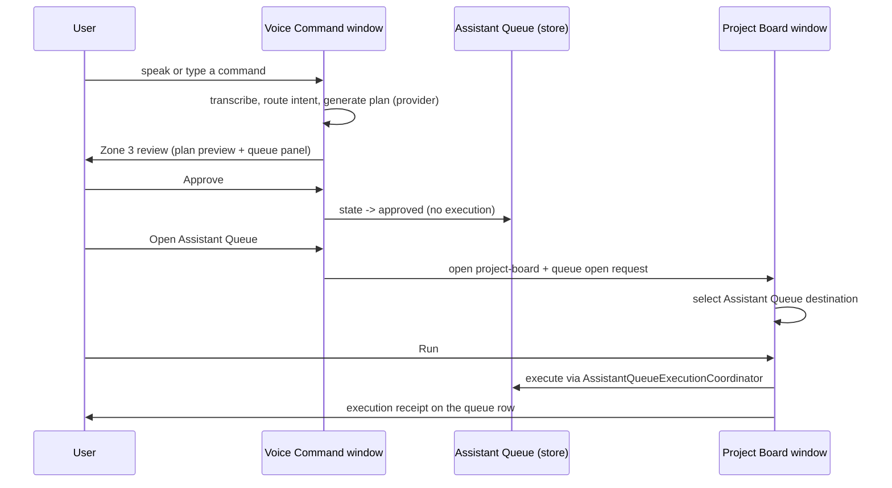
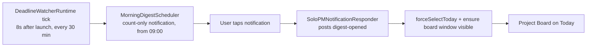
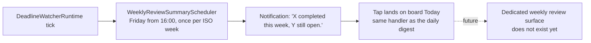

# Information Architecture

How SoloPM's four surfaces divide responsibility, the modal rules they
follow, and the primary flows between them. Every claim below is grounded in
the current code (files cited inline); the final section lists honest gaps.

## Window responsibilities

### Project Board window (`project-board`)

The main window (`Sources/SoloPMApp/Views/ProjectBoardView.swift`,
`ProjectWorkflow*.swift`).

Sidebar destinations, in rendered order (`ProjectBoardView.swift`, sidebar
`List`): **Inbox → Assistant Queue → Today → Catch Up → Schedule → Done**,
then a **Smart Lists** section, then a **Projects** section (Projects
overview row, active projects, Completed, Archived). The default destination
is **Today** (`ProjectBoardSelectionPersistence.swift`: persisted
`defaultRawValue = "today"`; unresolved selections fall back to `.today`).

Owns:
- All task/project reading and mutation surfaces: workflow views per
  destination, kanban columns per project (`ProjectBoardDetail`), task and
  project editing via the inspector, board operation undo (⌘Z,
  `BoardOperationUndo.swift`).
- The command palette (⌘K, `CommandPaletteView.swift`), including quick
  Inbox task creation and content search.
- Assistant Queue review **and execution**: the Run button in
  `ProjectWorkflowAssistantQueueView.swift` calls
  `ProjectBoardViewModel.runAssistantQueueItem(id:)`, which drives
  `AssistantQueueExecutionCoordinator` and produces execution receipts.

Does not do: voice capture, plan drafting, or settings — commands arrive
here already interpreted (from the Voice window, palette, or notifications).

### Voice Command window (`voice-capture`)

`Sources/SoloPMApp/Views/VoiceCaptureView.swift`, three stacked zones.

Owns:
- Capture (Zone 1): record/stop, typed transcript editing, Save to Inbox,
  Ask (workspace Q&A), Generate Plan, low-latency agent mode.
- Interpretation (Zone 2): streaming plan preview, routed intent preview,
  clarification Q&A, workspace answer display and TTS replay.
- Review handoff (Zone 3): plan preview, Assistant Queue panel with
  Approve / Defer / Reject and "Open Assistant Queue".

Does not do: execution. `VoiceCaptureViewModel.approveAssistantQueueItem`
only advances queue state and persists it; running an approved item happens
in the Project Board's Assistant Queue view. The capture placeholder states
the boundary: "Inbox captures stay local. Plans wait in Assistant Queue
before execution."

### Settings window

`Sources/SoloPMApp/Views/SettingsView.swift`. Six tabs
(`enum SettingsTab`): **Overview, Appearance, AI, MCP, Sync, Privacy**.

Owns:
- Two-tier disclosure: MCP and Sync are advanced tabs, hidden until the
  `solopm.settings.showAdvanced` toggle (`@AppStorage`, default off) is
  enabled; leaving advanced mode while on MCP/Sync falls back to Overview.
- Provider configuration and readiness (API keys in Keychain), voice model
  management, notification/quiet-hours preferences, backup/restore,
  diagnostics export, developer mode, launch-at-login, data location.

Does not do: task or plan content display — Overview shows status labels
only, and diagnostics/backup surfaces deal in counts and files, not rows.

### Menu bar panel

`MenuBarExtra` in `Sources/SoloPMApp/SoloPMApp.swift`; panel content in
`Sources/SoloPMApp/Views/MenuBarPanel.swift`.

Owns:
- Glanceable summary: label badge with overdue count when > 0; panel card
  with Today / Overdue / This Week counts and up to three recent projects
  (`Sources/SoloPMCore/App/MenuBarSummary.swift`).
- Quick capture to Inbox: one text field + Add (⌘↩) via
  `MenuBarQuickCaptureController` (creates a backlog task in the Inbox
  project, with natural-language due-date parsing).
- Window shortcuts: the summary card is one big "Open Today" button
  (forces the board onto Today), plus Project Board and Voice Command
  (⌥Space) buttons and a Settings link.

Does not do: task editing, plan review, or execution — every affordance
either captures one Inbox task or routes to a full window.

## Modal usage rules (as they exist)

- **Sheets** are used for self-contained create/edit flows that block their
  window: the smart list editor
  (`.sheet(isPresented: $isPresentingSmartListEditor)` →
  `SmartListEditorSheet`, `ProjectBoardView.swift` /
  `ProjectBoardSmartListViews.swift`), first-run onboarding
  (`.sheet(isPresented: $isOnboardingPresented)` → `OnboardingWelcomeView`,
  `SoloPMApp.swift`), and the development automation review panel
  (`.sheet(item: $developmentAutomationReviewSheet)` → `ActionReviewPanel`,
  `ProjectBoardView.swift`).
- **Inspector** is the task/project editing surface, not a sheet:
  `.inspector(isPresented:)` in `ProjectBoardView.swift` hosts
  `TaskInspectorView` or `ProjectInspectorView`; project destinations
  auto-open it.
- **Confirmation dialogs** guard destructive or externally visible actions
  only: "Delete MCP Server" and "Disconnect Google Calendar" (both
  `role: .destructive`, `SettingsView.swift`), "Sync due tasks to Google
  Calendar?" (external write, `ProjectBoardView.swift`), and "Restore from
  backup?" (`SettingsView.swift` — additive confirm, message states
  "Existing data is never changed or deleted"). Task/project delete and
  archive use an inline two-step destructive confirmation inside the
  inspector (`InspectorDestructiveConfirmation`, `ProjectBoardView.swift`)
  rather than a dialog.

## Primary flows

### Thought → voice → review → board

Verified in `VoiceCaptureView.swift` (`postAssistantQueueOpenRequest`),
`ProjectBoardView.swift` (`handleAssistantQueueOpenRequest`), and
`ProjectWorkflowAssistantQueueView.swift` (Run →
`runAssistantQueueItem(id:)`).

### Morning digest → Today → work

Verified in `Sources/SoloPMCore/Deadline/MorningDigest.swift` (one
count-only digest per day, hour ≥ 9),
`Sources/SoloPMApp/Composition/DeadlineWatcherRuntime.swift` and
`NotificationInteractionRuntime.swift`, and the app delegate observer in
`SoloPMApp.swift` (`ProjectBoardTodayNavigation.forceSelectToday()`).

### Weekly review (notification-only today)

Verified in `Sources/SoloPMCore/Deadline/WeeklyReviewSummary.swift`
(schedule-only, count-only body) and
`NotificationInteractionRuntime.swift`, where `solopm-weekly-review-`
notification taps share the daily digest branch and therefore open Today.
**Future marker:** there is no weekly-review window or destination; the
notification is currently the entire feature.

## Gaps and tensions

- **Knowledge frames have no viewing surface.** The command palette finds
  them in content search but "Knowledge frames do not have a dedicated view
  yet" (`CommandPaletteView.swift`); executing that palette action just
  closes the palette (`ProjectBoardView.swift`). They are effectively
  write/import-only (backup restore) plus search snippets.
- **Weekly review has no destination.** The Friday notification's tap falls
  through to Today; nothing shows more than the two counts in its body.
- **Workspace Q&A answers are ephemeral.** `workspaceAnswer` is in-memory
  state on `VoiceCaptureViewModel`; answers are lost on clear/new capture
  and are never persisted or linked to tasks.
- **Menu bar quick capture is deliberately narrow.** Inbox-only, backlog
  status, no project targeting — by design it skips queue/receipt/connector
  runtimes (`MenuBarQuickCaptureController.swift`), so triage always
  happens later on the board.
- **Approve and Run are two steps in two windows.** The voice window can
  approve but never run; users must cross to the board's Assistant Queue to
  execute. This is an intentional safety boundary, but the IA cost is a
  mandatory window switch in the happiest voice path.
